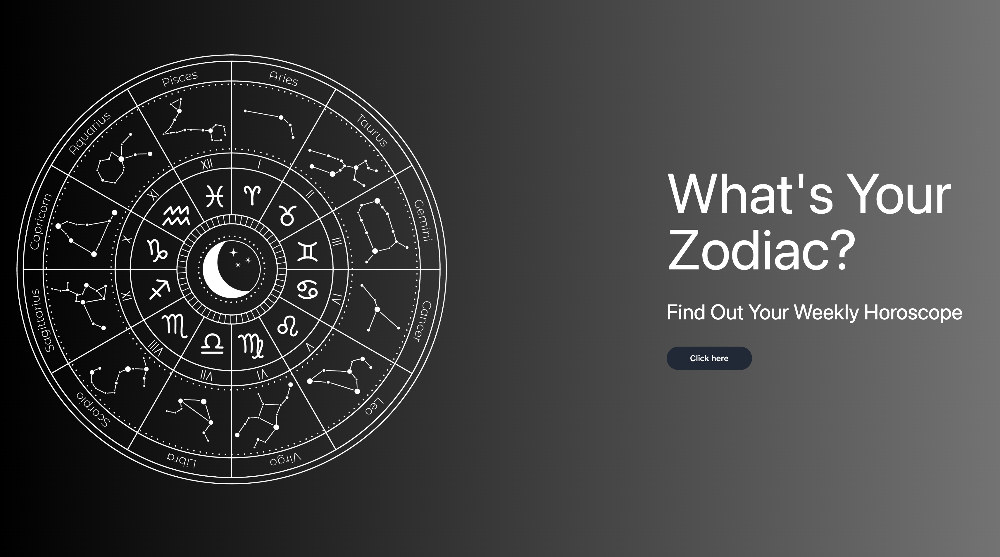
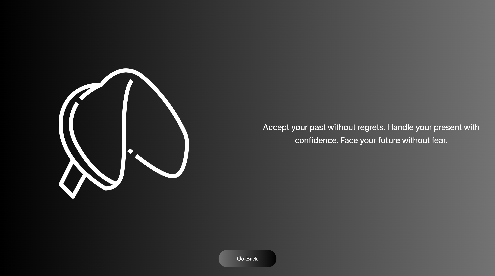

### Group Project 1: Horoscope + Fortune API Integration

* [Github Repository] (insert your link)
* [Deployed Github] (insert your link)

## Project 1 Front-End Application - Challenge Guideline
At the conclusion of each phase of this course, you’ll work with a group of your fellow students to create a project—collaborative work among a group of developers to create an application that solves a real-world problem. Projects model the experience you’ll encounter in every development role at any company, from large multinational businesses to small startups. Coding is collaborative.

A project is a bit different from the Challenge assignments you’ve worked on so far. One of the biggest differences is that you’ll no longer build an application by yourself! This has some advantages—you won’t have to do all of the work, you can divide up duties, and you can share skills and knowledge with other developers and rely on their strengths. Yet this can also be challenging if you’re used to working alone. Constant communication and time management are just two of the skills you’ll need to practice to make sure everyone in your group works together to complete the project.

You won't receive a user story or acceptance criteria for your projects, because you and your group will create them once you decide which real-world problem your application will solve. This lack of constraints can be freeing in a way, because you have room to build what you want, but it also means that you have to decide what those constraints are before you can start working.

Finally, a project requires a presentation, because you’re trying to convince an audience that it serves a purpose. Your instructional staff and fellow students are investors, and you’re pitching your creation to them—an experience that developers are required to do frequently. Your presentation is just as important as the actual project, so take it just as seriously.

## Project Requirements

With your team, you'll conceive and execute a design that solves a real-world problem by integrating data received from multiple server-side API requests. You'll also learn about agile development methodologies to help you work collaboratively. You'll implement feature and bug fixes using Git branch workflow and pull requests.

You'll write your own user stories and acceptance criteria in GitHub Issues to help your team stay on track with the project. Using GitHub Project to track the status of your project tasks will help you understand the benefits of Kanban boards.

You and your group will use everything you’ve learned over the past six modules to create a real-world front-end application that you’ll be able to showcase to potential employers. The user story and acceptance criteria will depend on the project that you create, but your project must fulfill the following requirements:

* Use a CSS framework other than Bootstrap.
* Be deployed to GitHub Pages.
* Be interactive (in other words, accept and respond to user input).
* Use at least two server-side APIsLinks to an external site..
* Use modals instead of alerts, confirms, or prompts.
* Use client-side storage to store persistent data.
* Be responsive.
* Have a polished UI.
* Have a clean repository that meets quality coding standards (file structure, naming conventions, best practices for class/id naming conventions, indentation, quality comments, and so on).
* Have a quality README (including a unique name, description, technologies used, screenshot, and link to the deployed application).

## Presentation Requirements

Use this Project Presentation TemplateLinks to an external site. to address the following:

* Elevator pitch: A one-minute description of your application.
* Concept: What is your user story? What was your motivation for development?
* Process: What were the technologies used? How were tasks and roles broken down and assigned? What challenges did you encounter? What were your successes?
* Demo: Show your stuff!
* Directions for future development.
* Links to the deployed application and the GitHub repository.

## User Story

```
AS A human interested in astrology 
I WANT to read about my zodiac sign’s weekly horoscope to get a glimpse of the possible future
SO THAT I am inspired to take action in life’s limitless possibilities 
```

## Acceptance Criteria

```
GIVEN I find APIs to integrate a webpage and concept
WHEN I search for 2 APIs
THEN I build a website that consists of the two APIs
WHEN I click on the zodiac page
THEN I am presented with another screen that has a dropdown of the 12 zodiac signs for me to choose from
WHEN I select my zodiac sign
THEN I am presented with another page that reads my weekly horoscope
WHEN I finish reading, I click on the second API button called "Unlock Your Fortune" below that page
THEN I am presented with another page where I can see the second API work to display my fortune
WHEN I click back
THEN I am looped back to the main page
```

## Summary

* HTML, CSS, & Javascript, 2 APIs,CSS Framework, and Canva were used to create the Horoscope + Fortune Reading Webpage
* This module 7 assignment requires to work collaboratively with peers to get hands-on action of what it's like to work in the real world
* See GIF below for the finished product walkthrough

## Features
# Walkthrough


* You are presented the homepage of the Zodiac
* Then you click "Click Here" which Javascript will lead you to another section
* That next section "Select Your Sign" is where users can choose their zodiac sign
* Once zodiac sign is selected, the API runs the selected sign and generates the "weekly horoscope" reading
* Below the page is "Unlock your Fortune" which is the second API
* Once clicked, the API generates a lucky fortune reading for the user
* Then, user can click "Go Back" button to where they are looped back to the home page.

##Screenshots of Webpage




# Taa-Daa! Magic Happens When You Work Together.